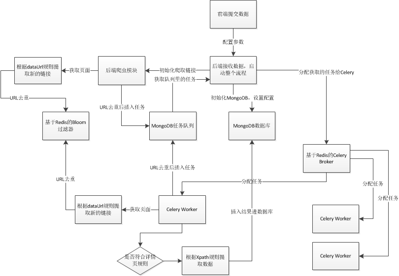
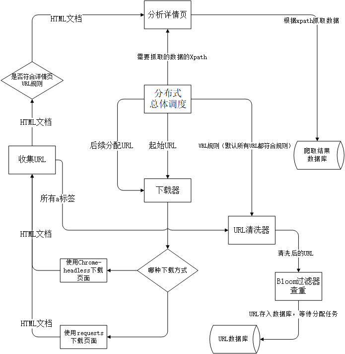

# CraystalCrawler:分布式爬虫框架

## 概览
CrystalCrawler是一个分布式的爬虫框架。
使用者无需编写代码，只需输入几个必要的参数即可从绝大多数博客类和电商类网站爬取结构化数据。
用户交互基于B/S结构，使用了Redis，Celery,MongoDB，Chrome-headless，Bloom过滤等技术。

## 环境要求
+ 操作系统Ubuntu 16.04
+ python 2.7

## 架构设计


总体工作流程

1.	前端获取包括起始URL、dataURL、detailURL、内容的名称和Xpath信息。
2.	Python后端获取到信息，初始化MongoDB数据库。
3.	开启爬虫模块先爬取一次满足规则的URL，通过Bloom去重后作为任务队列的初始化内容。
4.	Python后端将消费者需要的任务通过Celery的Broker分配给消费者。
5.	消费者获取任务开始爬取，如果碰到符合详情页规则的页面则开始具体分析，将分析结果放入存储结果的MongoDB数据库。
6.	重复4，5直到队列无新的任务后停止。
7.	前端可以随时通过请求后端获得当前数据库存储的数据。

## 爬虫流程


爬虫工作流程

1.	获取URL
1.	下载HTML文档
1.	收集a标签
1.	清洗去重URL
1.	URL存入数据库
1.	分析HTML文档
1.	爬取结果存入数据库

## 项目目录
```
|-- back						//分布式爬虫
|   |--back						//后端调度
|      |--static				//前端静态资源
|      |--Bloom.py				//URL查重器
|      |--Configer.py			//配置文件读取类
|      |--craw.py
|      |--Crystal.py			//爬虫类
|      |--Downloader.py			//下载器
|      |--LogUtil.py			//日志工具
|      |--models.py				//
|      |--Parser.py				//页面分析类
|      |--Rules.py				//URL匹配规则
|      |--settings.py			//配置文件
|      |--Tool.py				//通用工具类
|      |--urls.py
|      |--view.py
|      |--wsgi.py
|      |--Xpath.py				//Xpath规则容器
|   |--templates
|      |--index.html			//首页模板
|      |--loading.html			//监控爬虫页模板
|      |--results.html			//结果查看页模板
|   |--db.sqlite3
|   |--manage.py

```


## 使用方法

+ THE MAIN URL ：作为初始链接，需要一个完整的url，完整至http。（必填）
+ THE DETAIL URL：详情页链接url的正则表达示（可选）
+ THE DATA URL 1：用于限制爬取范围的url正则表达式（可选，可增加条目）
+ ATTRIBUTE NAME ： 想要爬取的属性的名称（必填，可增加条目）
+ XPATH：需要爬取的属性的XPATH（必填，可增加条目）


输入一个起始的网站地址，爬虫将以宽度优先的遍历顺序爬取网站中所有的链接。
给定想要抓取的元素的Xpath，爬虫就会在遍历过程中将匹配到的数据存入数据库。
如果用户指定了详情页的URL正则，那么爬虫就能更加精准地找到详情页。
如果用户指定了爬虫应该检索的URL正则，那么宽度优先搜索时的路径将更加精确，利用这个功能可以实现剪枝。


## 环境依赖

### URL去重
基于Redis的Bloom过滤器，需要安装Redis

### 结果存储
存储数据的MongoDB，需要安装MongoDB

### 任务队列
存储任务队列的MongoDB和Python后端位于同一台vps，需要MongoDB

### 消费者节点
消费者节点的生产环境部署参考python后端的部署

### Python后端：
1.	安装pip，sudo apt install python-pip
2.	安装Django，sudo pip install Django
3.	安装pymongo，sudo pip install pymongo
4.	安装lxml，sudo pip install lxml
5.	安装redis，sudo pip install redis
6.	安装requests，sudo pip install requests
7.	安装selenium，sudo pip install selenium
8.	安装celery，sudo pip install celery
9.	安装chrome，下载chrome开发版，下载地址：
10.	https://www.google.com/chrome/browser/desktop/index.html?extra=devchannel，下载需要翻墙，安装后可以在/opt/google/chrome-unstable/google-chrome-unstable处看到已经安装
11.	安装chromedricer至python执行文件的目录，如/usr/bin。先安装bsdtar，sudo apt-get install bsdtar。
12.	运行PLATFORM=linux64
13.	VERSION=$(curl http://chromedriver.storage.googleapis.com/LATEST_RELEASE.
14.	curl http://chromedriver.storage.googleapis.com/$VERSION/chromedriver_$PLATFORM.zip -o ~/1.zip 先安装到桌面，解压后，运行sudo cp ~/Desktop/chromedriver /usr/bin/chromedriver
15.	配置数据库地址，在Crystal.py中的 getXpathFromMGDB和getRulesFromMGDB函数中需要配置存储数据的MongoDB的ip地址信息。
16.	在Parser.py中的 collectURLs和initCollectURLs函数中需要配置任务队列的MongoDB的ip信息。同时在parseDetail函数中需要配置存储数据的MongoDB的ip地址信息。
17.	在view.py中多处需要配置数据库地址，其中CrystalCraw相关的是存储数据的数据库，UrlCollect相关的是任务队列的数据库。
